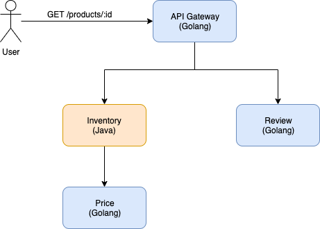

# Demo Elastic APM in microservice  
  
This is a fake Products system which is used to demonstrate using Elastic APM tracing (**APM tracing + log correlation**) in microservice system.  
  
## Usecase  
  
This contains only 1 simple use-case for demonstration purpose: a REST API for getting details information and customer's review of a product.  
  
  
  
## APM logging and tracing  
  
This project uses a custom library [nplog](https://github.com/duclm2609/nplog), a wrapper library that using [Uber's zap logger](https://github.com/uber-go/zap) as logging library, [lumberjack](https://github.com/natefinch/lumberjack) for log rotation and [Elastic APM Go agent (module apmzap)](https://github.com/elastic/apm-agent-go/tree/master/module/apmzap) for log correlation.  
  
## Usage  

 **1. Java**
 TBD

 **2. Golang**
 - Configure logger
 ``` go
 // Import logger library
import "github.com/duclm2609/nplog"

// Setup logger  
config := nplog.NpLoggerOption{  
  EnableConsole:  true,  // Enable console log
  EnableFile:     true,  // Enable file log, with rotation
  FileJSONFormat: true,  
  Filename:       "/var/logs/micro-api-gateway.log",
  FileMaxSize:    512,  
  FileMaxBackups: 1,  
  FileMaxAge:     1,  
  FileCompress:   true,  
  FileLevel:      nplog.Info,  
}  
logger, err := nplog.NewNpLogger(nplog.ZapLogger, config)

// Pass context for log correlation
logger.For(ctx).Infof("getting product detail information")
```
**Notes**: avoid package level logging, as stated [here]([https://dave.cheney.net/2017/01/23/the-package-level-logger-anti-pattern](https://dave.cheney.net/2017/01/23/the-package-level-logger-anti-pattern)).

 - Propagate trace context to other service via HTTTP request
 
Use helper package [ctxhttp]([https://pkg.go.dev/golang.org/x/net/context/ctxhttp?tab=doc](https://pkg.go.dev/golang.org/x/net/context/ctxhttp?tab=doc)):
 ``` go
 ctxhttp.Get(ctx, i.httpClient, "http://micro-inventory:8080/"+productId)
 ```

 
 **3. PHP**
 TBD